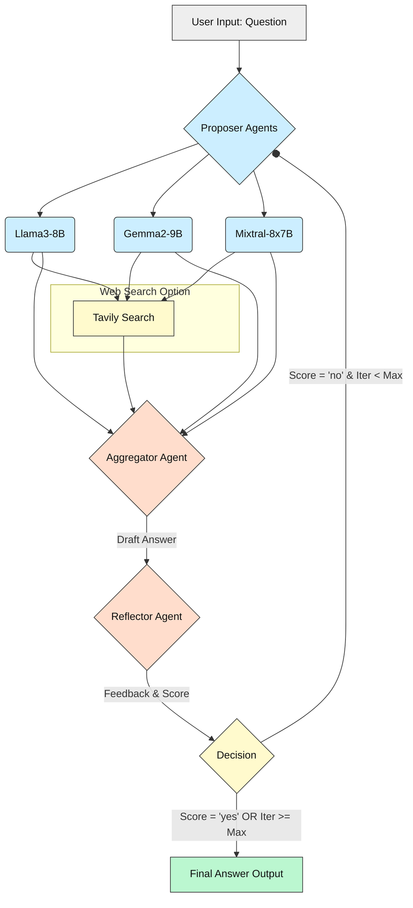
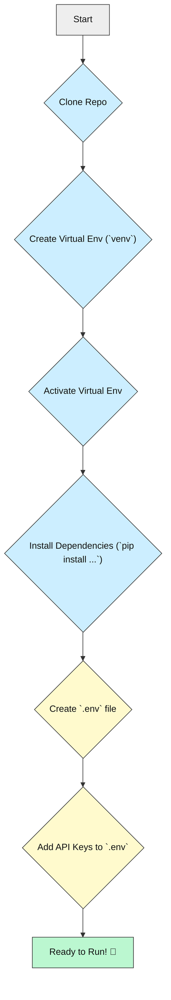

# MoGA: Mixture-of-Graph-Agents 🧠✨

[](https://opensource.org/licenses/MIT)


_An advanced Question-Answering system using multiple AI agents and web search to generate insightful, refined answers._

---

## What is MoGA? 🤔 ("What & Why")

Ever feel like one AI brain isn't enough? MoGA (Mixture-of-Graph-Agents) tackles complex questions by acting like a team of AI researchers!

- It uses **multiple different AI models** (like having several experts brainstorm) to propose initial answers.
- It **searches the web** using Tavily to find the latest information, ensuring answers aren't outdated.
- Another AI model acts as an **editor**, combining the best parts of all proposals into one strong draft.
- Finally, a **reflector** AI reviews the draft, provides feedback, and decides if more research (another loop) is needed.

This multi-step process aims to produce **deep, comprehensive, and high-quality answers** that go beyond what a single AI might generate. It's built for anyone curious about advanced AI techniques or needing detailed answers to tricky questions. While it takes a few minutes to run, the depth of the generated content is often significantly richer!

---

## Tech Stack 🛠️

| Area           | Technologies                                                                 | Notes                                      |
|----------------|------------------------------------------------------------------------------|--------------------------------------------|
| **Core Logic** | Python 3.10+                                                                 | Language                                   |
| **AI Orchestration** | Langchain, Langgraph                                                     | Framework for building AI agent workflows  |
| **AI Models**  | Groq API (Llama3-8B, Gemma2-9B, Mixtral-8x7B, Llama3-70B)                   | Multiple LLMs for proposing & aggregating |
| **Web Search** | Tavily API                                                                   | For real-time information retrieval        |
| **Database**   | SQLite                                                                       | For storing conversation context/memory    |
| **Database ORM**| SQLAlchemy                                                                   | Interacting with the SQLite database       |
| **CLI**        | Rich                                                                         | For beautiful terminal output & prompts    |
| **Config**     | python-dotenv                                                                | Managing API keys via `.env` file          |

*Make sure you have Python 3.10 or newer installed.*

---

## Key Features ✨

- **Multi-Agent Approach:** Leverages several different LLMs (Proposers) for diverse perspectives.
- **Aggregation:** Synthesizes multiple AI responses into a single, refined answer using a powerful Aggregator model (Llama3-70B).
- **Iterative Refinement:** Uses a Reflector model to critique the aggregated answer and loop back for improvements if needed.
- **Web Search Integration:** Can perform real-time web searches via Tavily for up-to-date information.
- **Context Persistence:** Saves conversation history to an SQLite database (`moga_memory.db`) to allow continuing tasks later.
- **Rate Limiting:** Basic mechanism to avoid hitting API limits too quickly.
- **Interactive CLI:** User-friendly command-line interface using the `rich` library.
- **Transparency:** Saves intermediate outputs from proposers, aggregator, and reflector to `.md` files (`prop_output.md`, `agg.md`, `reflect.md`) for inspection.

### Project File Structure

```
MoGA-Mixture-of-Graph-Agents/
├── .env                  # API Keys (you create this)
├── .gitignore            # Git ignore rules
├── moga.py               # Main application script
├── self_discover.py      # (Optional) Self-discovery module
├── LICENSE               # Project License file
├── moga_memory.db        # SQLite database for context (created on run)
├── prop_output.md        # Intermediate output (created on run)
├── agg.md                # Intermediate output (created on run)
├── reflect.md            # Intermediate output (created on run)
└── Vibe Coders README.md # This file!
```

---

## How It Works ⚙️ → System Overview

MoGA uses a graph-based workflow (thanks to Langgraph) to manage the conversation between different AI agents:

1.  **Input:** You provide a question or task.
2.  **Propose:** Several different "Proposer" AI models (Llama3-8B, Gemma2-9B, Mixtral-8x7B via Groq) each generate an initial response. They can trigger a web search if needed.
3.  **Aggregate:** An "Aggregator" AI model (Llama3-70B via Groq) reads all the proposals and synthesizes them into a single, improved draft answer.
4.  **Reflect:** A "Reflector" AI model (Llama3-70B via Groq) reviews the draft answer based on the original question. It gives feedback and decides ("yes" or "no") if the answer is complete and accurate.
5.  **Loop or End:**
    *   If the Reflector says "no" (or the max iterations haven't been reached), the feedback is sent back to the Proposers for another round (go back to Step 2).
    *   If the Reflector says "yes" (or max iterations are reached), the current draft becomes the final answer.

### MoGA Workflow Diagram



---

## Prerequisites & Accounts 🔑

Before you start, you'll need a few things:

1.  **Python:** Version 3.10 or newer. [Download Python](https://www.python.org/downloads/)
    *   *Why?* MoGA is written in Python and uses libraries that require a modern version.
2.  **Pip:** Python's package installer. Usually comes with Python.
    *   *Why?* Needed to install the project's dependencies (like Langchain, Groq, etc.).
3.  **Git:** Version control system. [Download Git](https://git-scm.com/downloads/)
    *   *Why?* Needed to clone (download) the project repository from GitHub.
4.  **Groq API Key:** Free API key for accessing fast LLMs. [Get Groq Key](https://console.groq.com/keys)
    *   *Why?* MoGA relies heavily on Groq's models for its core processing.
5.  **Tavily API Key:** API key for the web search functionality. [Get Tavily Key](https://tavily.com/)
    *   *Why?* Allows MoGA agents to search the web for current information.
6.  **(Optional) OpenAI API Key:** [Get OpenAI Key](https://platform.openai.com/api-keys)
    *   *Why?* The code includes `.env` setup for it, but the primary models run via Groq. Might be needed if you modify the code.
7.  **(Optional) Anthropic API Key:** [Get Anthropic Key](https://console.anthropic.com/dashboard)
    *   *Why?* Similar to OpenAI, included in `.env` setup but not used by default models.

---

## Setup — Get MoGA Running! 🚀

> **Goal:** Get this running in ~10-15 minutes. If you hit snags, don't worry! Check the error messages or ask for help.

We recommend using **virtual environments** – they keep project dependencies tidy and separate from your system's Python.

### Option 1: Virtual Environment (Recommended)

1.  **Clone the Repository:**
    Open your terminal or command prompt and run:
    ```bash
    git clone https://github.com/YOUR_USERNAME/MoGA-Mixture-of-Graph-Agents.git # Replace with actual repo URL if different
    cd MoGA-Mixture-of-Graph-Agents
    ```

2.  **Create a Virtual Environment:**
    ```bash
    python -m venv venv
    ```
    *This creates a `venv` folder in your project directory.*

3.  **Activate the Virtual Environment:**
    *   On **macOS / Linux**:
        ```bash
        source venv/bin/activate
        ```
    *   On **Windows (Command Prompt)**:
        ```bash
        venv\Scripts\activate
        ```
    *   On **Windows (PowerShell)**:
        ```bash
        .\venv\Scripts\Activate.ps1
        ```
    *   *(You should see `(venv)` appear at the start of your terminal prompt)*

4.  **Install Dependencies:**
    Since `requirements.txt` is missing, install the core libraries directly:
    ```bash
    pip install langchain langgraph langchain-openai langchain-anthropic langchain-groq sqlalchemy python-dotenv rich tavily-python pydantic
    ```
    *(This might take a minute)*

5.  **Set Up API Keys:**
    *   Create a file named `.env` in the main project folder (`MoGA-Mixture-of-Graph-Agents/`).
    *   Copy and paste the following into `.env`, replacing `your_..._key` with your actual API keys:
        ```dotenv
        # .env file
        OPENAI_API_KEY=your_openai_api_key_optional
        GROQ_API_KEY=your_groq_api_key_required
        ANTHROPIC_API_KEY=your_anthropic_api_key_optional
        TAVILY_API_KEY=your_tavily_api_key_required
        ```
    *   **Important:** Make sure the `.env` file is listed in your `.gitignore` file (it should be by default) to avoid accidentally sharing your secret keys!

You're all set up!

### Option 2: Docker

*   Docker setup is not currently provided for this project. Stick with the Virtual Environment method for now.

---

## Visual Setup Guide 🗺️

Here's a map of the setup process:



---

## Running the Project ▶️

Make sure your virtual environment is activated (`(venv)` should be visible in your terminal prompt).

Then, simply run the main script:

```bash
python moga.py
```

Follow the prompts in your terminal:
1.  Enter your question or task.
2.  Specify the maximum number of refinement iterations (default is 3).
3.  Choose whether to use the experimental Self-Discover feature (default is no).

The script will then start the multi-agent process. You'll see status updates in the terminal. Intermediate outputs will be saved to `prop_output.md`, `agg.md`, and `reflect.md`. The final answer will be displayed in the terminal, and the conversation context will be saved to `moga_memory.db` using a task ID.

To **continue a previous conversation**, run the script and enter `CONTINUE:your_task_id` when prompted for the query.

To **exit**, type `exit` or `quit` at the query prompt.

---

## Configuration & API Keys ⚙️🔑

All necessary configuration, specifically your secret API keys, is handled through the `.env` file in the project's root directory.

**Why API Keys?**
MoGA needs keys to talk to external services:
-   **Groq:** Provides the powerful and fast AI models that do the proposing, aggregating, and reflecting.
-   **Tavily:** Enables the agents to perform web searches for current events or information not in their training data.

**How to Set Up:**
1.  Create the `.env` file if it doesn't exist.
2.  Copy the format from Step 5 in the Setup section.
3.  Paste your actual keys obtained from Groq and Tavily.
4.  **Keep this file secure and DO NOT commit it to public Git repositories.** The `.gitignore` file should prevent this by default.

The script uses the `python-dotenv` library to automatically load these keys when you run `python moga.py`.

---

## Status & Roadmap 🚦

-   ✅ Core multi-agent (Propose-Aggregate-Reflect) workflow operational.
-   ✅ Web search integration via Tavily.
-   ✅ Interactive CLI with `rich`.
-   ✅ Context saving/loading via SQLite database.
-   ✅ Intermediate file outputs for transparency.
-   ⏳ Self-Discover feature is experimental (`self_discover.py`).
-   ⚠️ Rate limiting is basic; could be more robust.
-   ⚠️ Error handling can be improved for edge cases (e.g., API failures).
-   🔜 More sophisticated error handling and recovery.
-   🔜 Option to configure different models easily.
-   🔜 Potential web interface? (Community contribution idea!)

---

## How AI Helped Build This 🤖✨

This project heavily relies on AI!
-   Multiple Large Language Models (LLMs) from Groq form the core "brains" of the agent system.
-   The entire concept is about orchestrating different AI capabilities (generation, synthesis, critique) using Langchain/Langgraph.
-   Developing and debugging complex AI interactions like this often involves pair programming *with* AI assistants to explore ideas and troubleshoot code.

---

## License 📜

This project is licensed under the **MIT License**. You can find the full license text in the [LICENSE](./LICENSE) file.

---

## Contribute & Connect 🙌

Found a bug? Have an idea for improvement? Want to contribute? That's awesome!

-   **Issues:** Please feel free to open an issue on the GitHub repository if you encounter problems or have suggestions.
-   **Pull Requests:** Contributions are welcome! If you'd like to add features or fix bugs, please submit a pull request.
-   **Questions:** Don't hesitate to ask questions via GitHub Issues.

We encourage collaboration and feedback from everyone, regardless of your coding experience!

---

# _Let the Mixture-of-Graph-Agents find the answers you seek!_
